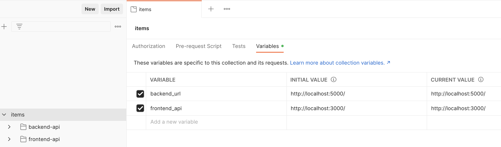

# Items Project

## Requerimientos
- Java 17+
- Maven
- Node 20+ LTS
- Postman (opcional)

## Stack
- H2 (Base de Datos)
- Springboot (Backend)
- NextJS (Frontend)
- Github

## Cloud Providers
- Backend
    - AWS Elastic Beanstalk
- Frontend
    - Vercel

## Ejecución de aplicaciones
- Backend (backend/items)
    - `mvn spring-boot:run`
- Frontend (frontend/items-app)
    - `npm install`
    - `npm run dev`

## Arquitectura

## URL's

### Desarrollo

- Backend
http://localhost:5000/items 

- Frontend
http://localhost:3000

### Producción

- Backend
http://items-service-env.eba-xptv2yau.us-east-1.elasticbeanstalk.com/items

- Frontend
https://items-topaz.vercel.app/items

- Frontend API
https://items-topaz.vercel.app/api/items

## QA

- Abrir el programa Postman.
- Importar el archivo `items.postman_collection.json` ubicado en la carpeta `qa`
- Cambiar las URL para entorno desarrollo o producción.
