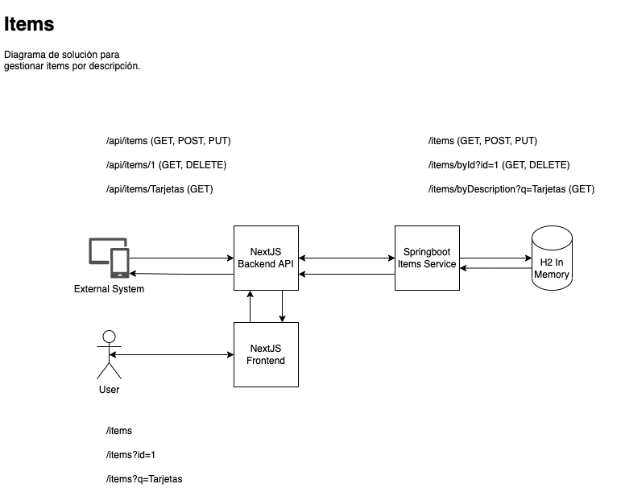

# Items Project

### Requerimientos
- Java 17+
- Node 20+ LTS

### Stack
- H2 (Base de Datos)
- Springboot (Backend)
- NextJS (Frontend)

### Arquitectura

### URL Producción

- Backend
http://items-service-env.eba-xptv2yau.us-east-1.elasticbeanstalk.com/items

- Frontend
https://items-topaz.vercel.app/items

- Frontend API
https://items-topaz.vercel.app/api/items

